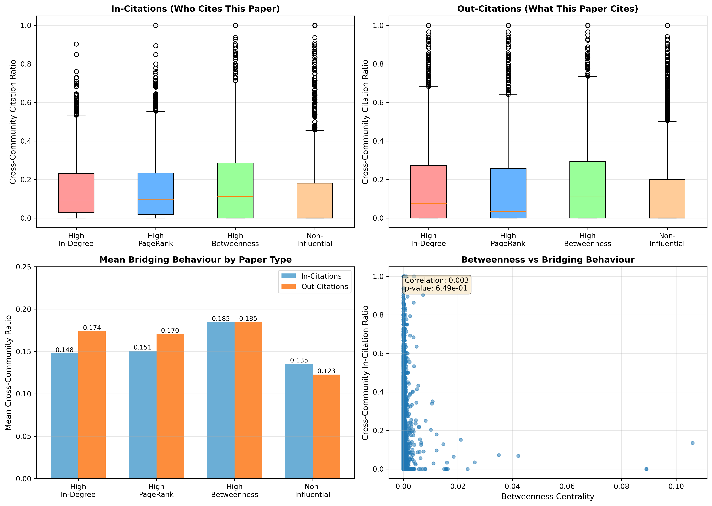

# HEP-Th Citation Network Analysis: Bridging vs. Siloing

## Research Question

**Do influential papers in High Energy Physics Theory (HEP-Th) bridge diverse research communities, or do they reinforce disciplinary silos?**

## Overview

This project analyzes the citation network from arXiv's High Energy Physics Theory (HEP-Th) category to understand whether influential papers serve as bridges connecting different research communities or as pillars reinforcing disciplinary boundaries.

## Key Findings

### Main Conclusion
**Influential papers PREDOMINANTLY REINFORCE SILOS** rather than bridging diverse research communities.

### Summary Statistics
- **Network Size**: 27,770 papers, 352,807 citations
- **Community Structure**: High modularity (0.51) with 3 dominant communities containing 89% of papers
- **Cross-Community Citations**: 
  - Influential papers: ~15-18% 
  - Non-influential papers: ~12-13%
  - Over **80% of citations stay within communities** for all paper types

### Key Insights

1. **Strong Disciplinary Boundaries**: Three major research communities with clear intellectual separation
2. **Limited Bridging**: Even the most influential papers derive over 80% of citations from within their own community
3. **Types of Influence**:
   - High betweenness papers: Best bridging (18%) - structural connectors
   - High PageRank papers: Elite influence within narrow circles
   - High in-degree papers: Most cited, reinforce community boundaries
4. **Structural vs. Direct Bridging**: Weak negative correlation between betweenness centrality and cross-community citations suggests structural bridge positions don't translate to direct cross-boundary citations

## Methodology

### Analysis Pipeline

1. **Load Network & Basic Statistics**
   - Load HEP-Th citation network as directed graph
   - Compute nodes, edges, density, degree distributions

2. **Identify Influential Papers** (Top 10%)
   - In-degree centrality (most cited)
   - PageRank (quality-weighted citations)
   - Betweenness centrality (structural bridges)

3. **Community Detection**
   - Modularity maximization (greedy algorithm)
   - Assign papers to communities
   - Measure network modularity

4. **Measure Bridging Behavior**
   - Cross-community citation ratio = (citations to different communities) / (total citations)
   - Calculate separately for in-citations and out-citations

5. **Compare Groups**
   - Influential vs. non-influential papers
   - Different types of influence (in-degree, PageRank, betweenness)

6. **Visualize Results**
   - Box plots: Cross-community ratios by paper type
   - Bar charts: Mean bridging behavior
   - Scatter plot: Betweenness vs. bridging behavior

## Installation

### Requirements

```bash
pip install -r requirements.txt
```

Required packages:
- `networkx>=3.0`
- `numpy>=1.20`
- `pandas>=1.3`
- `matplotlib>=3.5`
- `scipy>=1.7`

### Quick Start

```bash
# Clone the repository
git clone https://github.com/dhruva-divate/hep-citation-analysis.git

cd hep-citation-analysis

# Install dependencies
pip install -r requirements.txt

# Run the analysis
python hep_citation_analysis.py --data cit-HepTh.txt --output-dir results
```

## Usage

### Basic Usage

```bash
python hep_citation_analysis.py
```

This assumes `cit-HepTh.txt` is in the current directory and will output results to the current directory.

### Advanced Options

```bash
python hep_citation_analysis.py \
    --data path/to/cit-HepTh.txt \
    --output-dir results/ \
    --top-percent 10
```

**Arguments:**
- `--data`: Path to citation network edge list file (default: `cit-HepTh.txt`)
- `--output-dir`: Directory for output files (default: current directory)
- `--top-percent`: Percentage of top papers to consider influential (default: 10)

### Output Files

The script generates:
- `bridging_analysis.png`: Comprehensive visualization with 4 subplots
- Console output: Detailed statistics and interpretations for each analysis step

## Data

### Source
- **Dataset**: [SNAP: cit-HepTh](https://snap.stanford.edu/data/cit-HepTh.html)
- **Description**: Citation network from arXiv HEP-Th (High Energy Physics - Theory)
- **Format**: Edge list (tab or space separated)
- **Size**: 27,770 papers, 352,807 citation links
- **Time Period**: Papers from January 1993 to April 2003

### Data Format
```
# Source  Target
9201234   9301456
9301456   9401123
...
```

### Download
```bash
wget http://snap.stanford.edu/data/cit-HepTh.txt.gz
gunzip cit-HepTh.txt.gz
```

## Results

### Visualizations



The visualization includes four key plots:

1. **Top-left**: In-citations cross-community ratios (who cites this paper)
2. **Top-right**: Out-citations cross-community ratios (what this paper cites)
3. **Bottom-left**: Mean bridging behavior by paper type
4. **Bottom-right**: Betweenness centrality vs. cross-community citation ratio

### Statistical Summary

| Paper Type | In-Citations Mean | In-Citations Median | Out-Citations Mean | Out-Citations Median |
|-----------|------------------|---------------------|-------------------|---------------------|
| High Betweenness | 18.5% | 11.1% | 18.3% | 11.1% |
| High PageRank | 15.1% | 9.4% | 17.0% | 3.5% |
| High In-Degree | 14.7% | 9.3% | 17.3% | 10.5% |
| Non-Influential | 13.3% | 0.0% | 11.9% | 0.0% |

**Key Observation**: Median of 0% for non-influential papers means over half have NO cross-community citations.

## Project Structure

```
hep-citation-analysis/
 README.md                   # This file
 requirements.txt            # Python dependencies
 hep_citation_analysis.py    # Main analysis script
 cit-HepTh.txt              # Citation network data (download separately)
 bridging_analysis.png       # Output visualization
 LICENSE                     # MIT License
 .gitignore                 # Git ignore file
```

## Technical Details

### Logical Flow Review 

The code follows a sound logical progression:

1. **Network Loading**: Proper directed graph construction from edge list
2. **Centrality Measures**: Three complementary measures capture different types of influence
3. **Community Detection**: Modularity maximization on undirected graph (correct approach)
4. **Bridging Calculation**: Separate in/out calculations with proper handling of edge cases
5. **Statistical Comparison**: Comprehensive comparison across multiple paper groups
6. **Visualization**: Clear, publication-quality multi-panel figure

### Code Improvements Made

From notebook to script:
-  Added proper function structure and documentation
-  Implemented command-line arguments for flexibility
-  Added error handling and validation
-  Organized code into logical sections with clear progression
-  Added comprehensive print statements for interpretation
-  Made output directory configurable
-  Added proper main() function with argparse

### Performance Notes

- **Betweenness Centrality**: Computationally expensive O(n^3), script uses sampling (k=5000 nodes)
- **Memory Usage**: ~1-2 GB for full network
- **Runtime**: ~2-5 minutes on modern hardware
- **Scalability**: Can handle networks with 100K+ nodes with sampling

## Citation

If you use this analysis in your work, please cite:

```bibtex
@misc{hep_citation_analysis_2025,
  author = {Dhruva Divate},
  title = {HEP-Th Citation Network Analysis: Bridging vs. Siloing},
  year = {2025},
  publisher = {GitHub},
  url = {https://github.com/dhruva-divate/hep-citation-analysis}
}
```

Original dataset:
```bibtex
@misc{snapnets,
  author = {Jure Leskovec and Andrej Krevl},
  title = {{SNAP Datasets}: {Stanford} Large Network Dataset Collection},
  howpublished = {\url{http://snap.stanford.edu/data}},
  month = jun,
  year = 2014
}
```

## License

MIT License - see LICENSE file for details

## Contributing

Contributions are welcome! Please feel free to submit a Pull Request. For major changes, please open an issue first to discuss what you would like to change.

## Future Work

Potential extensions of this analysis:

1. **Temporal Analysis**: How has bridging behavior evolved over time?
2. **Content Analysis**: Do paper abstracts/titles reveal topical differences between communities?
3. **Author Networks**: Do author collaboration patterns mirror citation patterns?
4. **Comparative Study**: Compare HEP-Th with other arXiv categories
5. **Intervention Studies**: What factors promote cross-community citation?
6. **Newer Data**: Data is around 2000s, does siloing behaviour still exist?
## Acknowledgments

- Stanford Network Analysis Project (SNAP) for providing the dataset
- arXiv for making scientific papers freely available
- NetworkX development team for excellent graph analysis tools
